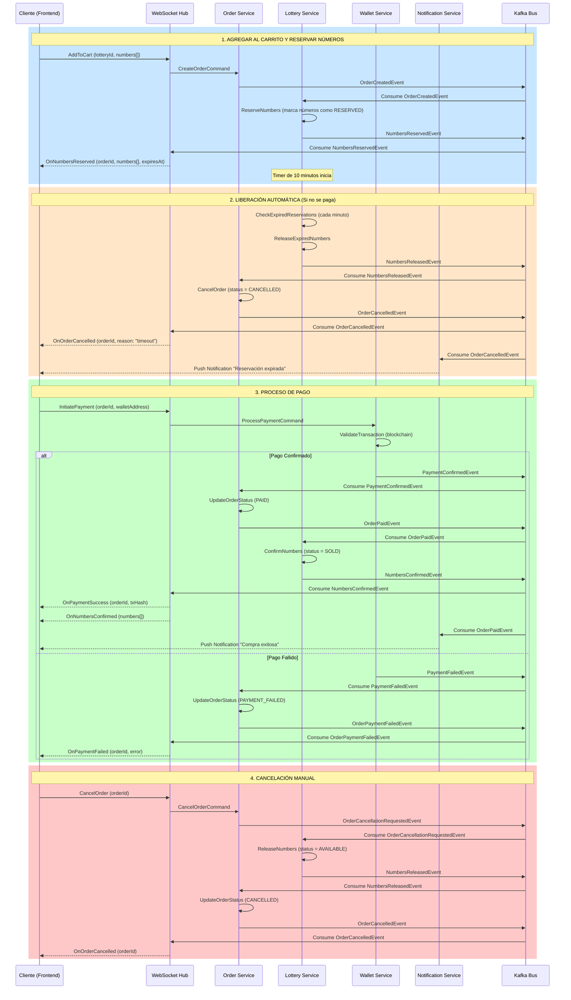
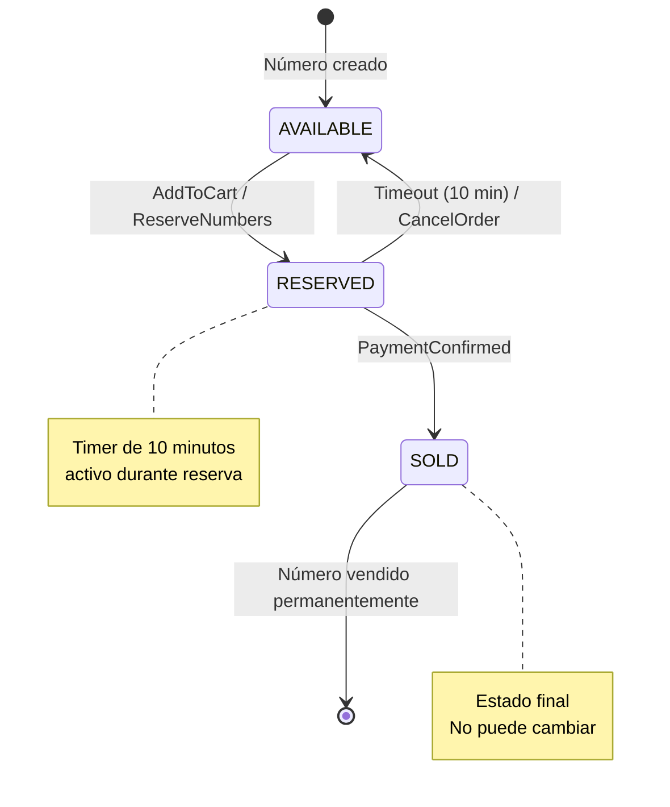
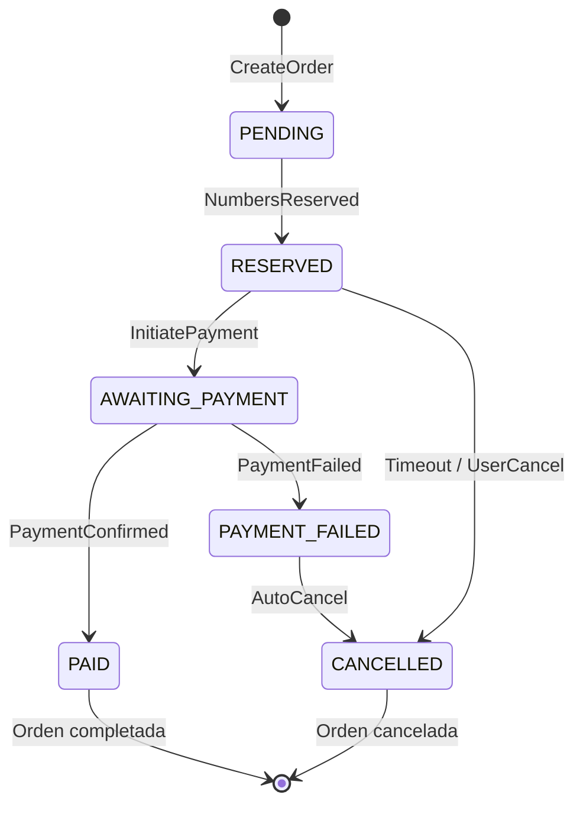
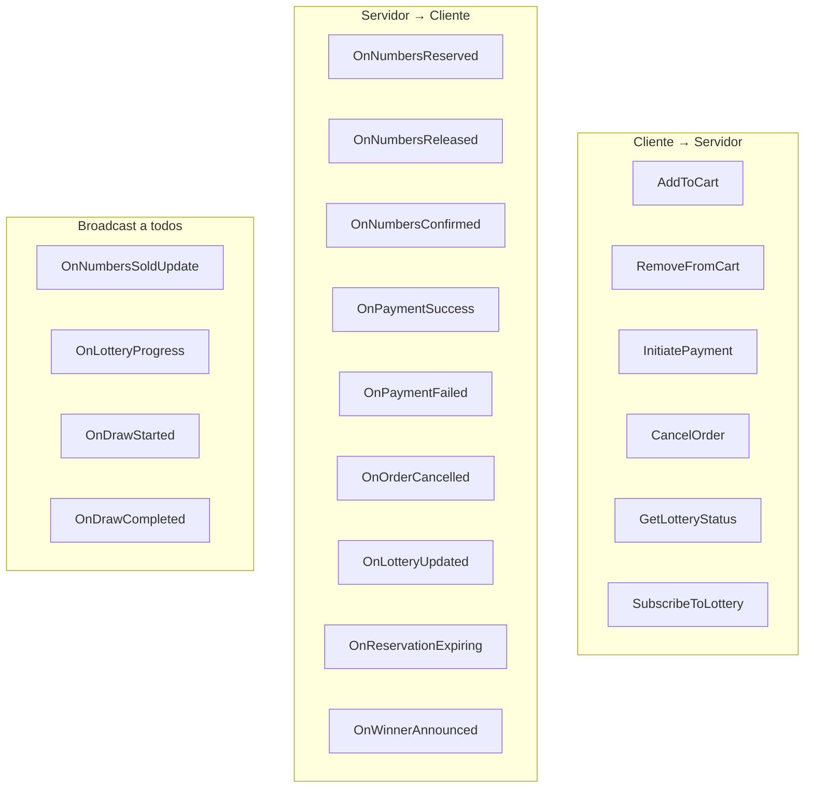
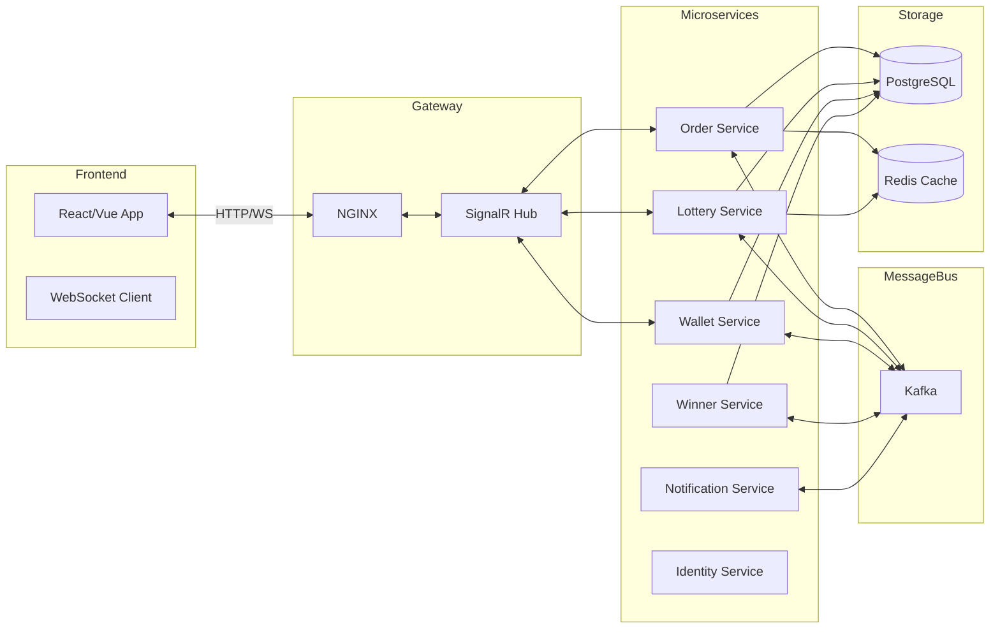

# Diagrama de Procesos y Eventos WebSocket - CryptoJackpot

## Flujo Principal del Sistema

## Diagrama de Estados de los Números

## Diagrama de Estados de la Orden

## Eventos WebSocket (SignalR)

## Flujo de Integración de Servicios

## Eventos de Kafka (Integration Events)

| Evento | Productor | Consumidores | Descripción |
|--------|-----------|--------------|-------------|
| `OrderCreatedEvent` | Order | Lottery | Orden creada, reservar números |
| `NumbersReservedEvent` | Lottery | Order, Notification | Números reservados exitosamente |
| `NumbersReleasedEvent` | Lottery | Order, Notification | Números liberados (timeout/cancel) |
| `PaymentConfirmedEvent` | Wallet | Order, Lottery | Pago confirmado en blockchain |
| `PaymentFailedEvent` | Wallet | Order | Pago falló |
| `OrderPaidEvent` | Order | Lottery, Notification, Winner | Orden pagada completamente |
| `OrderCancelledEvent` | Order | Notification | Orden cancelada |
| `LotteryCompletedEvent` | Lottery | Winner | Lotería lista para sorteo |
| `WinnerSelectedEvent` | Winner | Notification, Wallet | Ganador seleccionado |
| `PrizeDistributedEvent` | Wallet | Notification | Premio enviado al ganador |

## Resumen de Flujos

### 1. Agregar al Carrito
1. Usuario selecciona números
2. Se crea orden en estado PENDING
3. Lottery Service reserva los números (estado RESERVED)
4. Se inicia timer de 10 minutos
5. Usuario recibe confirmación via WebSocket

### 2. Proceso de Pago
1. Usuario inicia pago con dirección de wallet
2. Wallet Service verifica transacción en blockchain
3. Si confirmado: Order → PAID, Numbers → SOLD
4. Si falla: Order → PAYMENT_FAILED, Numbers → AVAILABLE

### 3. Liberación Automática
1. Background job verifica reservaciones cada minuto
2. Si expiró (10 min): Numbers → AVAILABLE, Order → CANCELLED
3. Usuario recibe notificación de expiración

### 4. Cancelación Manual
1. Usuario cancela orden
2. Numbers → AVAILABLE
3. Order → CANCELLED
4. Confirmación via WebSocket
