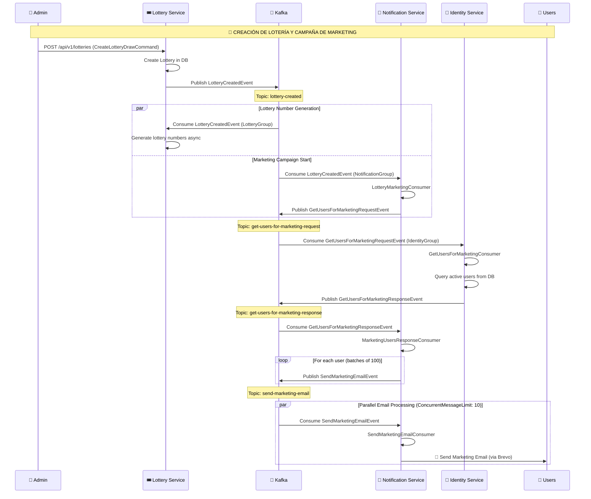

# 📧 Flujo de Marketing de Lotería - Patrón Saga

Este documento describe el flujo de eventos cuando se crea una nueva lotería y se envían emails de marketing a todos los usuarios registrados.

---

## 🔄 Diagrama de Flujo



---

## 📦 Eventos Involucrados

### 1. LotteryCreatedEvent
**Publisher:** Lottery Service  
**Topic:** `lottery-created`  
**Consumers:**
- Lottery Service (genera números de lotería)
- Notification Service (inicia campaña de marketing)

```csharp
public class LotteryCreatedEvent : Event
{
    public Guid LotteryId { get; set; }
    public long LotteryDbId { get; set; }
    public int MinNumber { get; set; }
    public int MaxNumber { get; set; }
    public int TotalSeries { get; set; }
    public string Title { get; set; }
    public string Description { get; set; }
    public decimal TicketPrice { get; set; }
    public DateTime StartDate { get; set; }
    public DateTime EndDate { get; set; }
    public int MaxTickets { get; set; }
}
```

### 2. GetUsersForMarketingRequestEvent
**Publisher:** Notification Service  
**Topic:** `get-users-for-marketing-request`  
**Consumer:** Identity Service

```csharp
public class GetUsersForMarketingRequestEvent : Event
{
    public Guid CorrelationId { get; set; }
    public Guid LotteryId { get; set; }
    public string LotteryTitle { get; set; }
    // ... lottery info passed through for the response
    public bool OnlyActiveUsers { get; set; } // Status = true means email confirmed
}
```

### 3. GetUsersForMarketingResponseEvent
**Publisher:** Identity Service  
**Topic:** `get-users-for-marketing-response`  
**Consumer:** Notification Service

```csharp
public class GetUsersForMarketingResponseEvent : Event
{
    public Guid CorrelationId { get; set; }
    public List<MarketingUserInfo> Users { get; set; }
    public bool Success { get; set; }
    public string? ErrorMessage { get; set; }
    // ... lottery info passed through
}
```

### 4. SendMarketingEmailEvent
**Publisher:** Notification Service (MarketingUsersResponseConsumer)  
**Topic:** `send-marketing-email`  
**Consumer:** Notification Service (SendMarketingEmailConsumer)

```csharp
public class SendMarketingEmailEvent : Event
{
    public string Email { get; set; }
    public string UserName { get; set; }
    public Guid LotteryId { get; set; }
    public string LotteryTitle { get; set; }
    // ... más campos
    public Guid CampaignId { get; set; }
    public int BatchNumber { get; set; }
}
```

---

## 🏗️ Arquitectura del Patrón Saga

```
┌─────────────────────────────────────────────────────────────────────────┐
│                           KAFKA (Compartido)                             │
│                                                                          │
│  ┌─────────────────┐  ┌──────────────────────────┐  ┌─────────────────┐ │
│  │ lottery-created │  │get-users-for-marketing-* │  │send-marketing-  │ │
│  │                 │  │  request / response      │  │     email       │ │
│  └────────┬────────┘  └────────────┬─────────────┘  └────────┬────────┘ │
└───────────┼────────────────────────┼─────────────────────────┼──────────┘
            │                        │                         │
    ┌───────┴───────┐        ┌───────┴───────┐         ┌───────┴───────┐
    │               │        │               │         │               │
    │   Lottery     │        │   Identity    │         │  Notification │
    │   Service     │        │   Service     │         │   Service     │
    │               │        │               │         │               │
    │ • Publish     │        │ • Consume Req │         │ • Consume     │
    │   event       │        │ • Query users │         │   lottery-    │
    │               │        │ • Publish Res │         │   created     │
    └───────────────┘        └───────────────┘         │ • Publish Req │
                                                       │ • Consume Res │
                                                       │ • Queue emails│
                                                       │ • Send emails │
                                                       └───────────────┘
```

---

## ✅ Ventajas del Patrón Saga

1. **Desacoplamiento total**: Los servicios no se conocen directamente entre sí
2. **Escalabilidad**: Kafka permite procesar 100,000+ emails en paralelo
3. **Resiliencia**: Si un servicio falla, los mensajes quedan en Kafka para reintentar
4. **Trazabilidad**: El `CorrelationId` permite rastrear toda la campaña
5. **Sin bloqueos**: No hay timeouts de Request/Response

---

## 🔧 Consumer Groups

| Service | Consumer Group | Topics Consumed |
|---------|----------------|-----------------|
| Lottery | `lottery-group` | `lottery-created` |
| Identity | `identity-group` | `get-users-for-marketing-request` |
| Notification | `notification-group` | `lottery-created`, `get-users-for-marketing-response`, `send-marketing-email` |

---

## 📊 Configuración de Escalabilidad

El `SendMarketingEmailConsumer` tiene configurado:
```csharp
e.ConcurrentMessageLimit = 10;
```

Esto permite procesar hasta 10 emails concurrentemente por instancia del Notification Service. 
Con múltiples instancias, la capacidad se multiplica.
